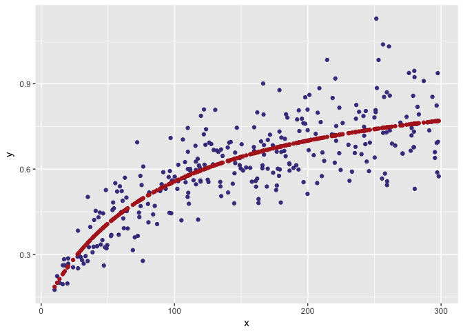

optimhelp
=========

Installation
------------

    devtools:::install_github("kylebaron/optimhelp")

Use
---

    library(optimhelp)
    library(ggplot2)

So far, this is a **parameter management system**. We can name and set
initial values for parameters in a model. We can also specify a
transformation for each parameter: the value is transformed to a
different scale for estimation and it can be transformed back when
either getting a prediction or after the optimization is finished. Also,
`parset` objects allow you to fix parameters in the optimization.

In this example, both `CL` and `VC` are estimated as log-transformed
values.

    cl <- log_par("CL", 1.2)
    vc <- log_par("VC", 22.3)

    cl

    .  name value transf tr fx
    .    CL   1.2    log  u

Make a `parset` object

    p <- parset(cl,vc)

The `parset` object

    p

    .  name value transf tr fx
    .    CL   1.2    log  u   
    .    VC  22.3    log  u

Check what the transformed values look like

    trans(p)

    .  name     value transf tr fx
    .    CL 0.1823216    log  t   
    .    VC 3.1045867    log  t

or generate initial values on the estimation scale

    start.values <- initials(p)
    start.values

    .        CL        VC 
    . 0.1823216 3.1045867

Grafting back into the `parset` object gets us untransformed (by
default)

    graft(p,start.values + 0.5)

    .  name     value transf tr fx
    .    CL  1.978466    log  u   
    .    VC 36.766484    log  u

Examples
========

Simulate some data
------------------

    set.seed(292)

    x <- runif(300,10,300)
    y <- (0.1 + 0.9*x/(100+x))*exp(rnorm(length(x),0,sqrt(0.025)))
    data <- data.frame(x=x,y=y)
    head(data)

    .           x         y
    . 1 122.01323 0.7223047
    . 2  83.96901 0.4407091
    . 3 151.43117 0.5948464
    . 4 109.99034 0.7444994
    . 5 200.64816 0.6664930
    . 6 259.40643 0.5438206

    qplot(x,y,data=data, geom="point")

Specify parameters
------------------

We will restrict emax to be between 0 and 1 for now. Also sending a
fixed parameter through for fun.

    emax <- logit_par("emax", 0.6)
    ec50 <- log_par("ec50", 60)
    e0 <- ident_par("e0", 0.1, fixed=TRUE)
    p <- parset(emax,ec50,e0)
    p

    .  name value transf tr fx
    .  emax   0.6  logit  u   
    .  ec50  60.0    log  u   
    .    e0   0.1  ident  u  *

Fit with `optim`
----------------

In the `pred` function below

1.  Graft the estimated proposed by the optimzer back into the `parset`
    object
    -   By default, grafting untransforms all values in the `parset`

2.  Coerce to `list` so we can use to generate predictions

<!-- -->

    pred <- function(est,p, x,pred=FALSE) {
      est <- as.list(graft(p,est))
      yhat <- est$e0 + est$emax*x/(x+est$ec50)
      if(pred) return(yhat)
      sqres <- (y-yhat)^2
      return(sum(sqres))
    }

1.  Use `initials` to transform the starting values at the start of the
    optimization
2.  Pass the `parset` object into the prediction function so we can
    graft the estimates back in

<!-- -->

    fit <- optim(par=initials(p),fn=pred,p=p,x=x)

Notice that, when we passed in the starting estimates, `optim` doesn't
get exposed to any fixed parameter

    initials(p)

    .      emax      ec50 
    . 0.4054651 4.0943446

After the fitting is done, graft the final estimates back into the
`parset` and take a look.

    est <- graft(p,fit$par)

    est

    .  name      value transf tr fx
    .  emax  0.8767399  logit  u   
    .  ec50 92.2259710    log  u   
    .    e0  0.1000000  ident  u  *

A `coef` method will give just the non-fixed values

    coef(est)

    .       emax       ec50 
    .  0.8767399 92.2259710

Otherwise, we can get everything like this

    as.numeric(est)

    .       emax       ec50         e0 
    .  0.8767399 92.2259710  0.1000000

Check things out

    data$pred <- pred(initials(est),p,x,pred=TRUE)

    ggplot(data) + 
      geom_point(aes(x,y),    col="darkslateblue") + 
      geom_point(aes(x,pred), col="firebrick")

Fit with `nls`
--------------

Here, we'll access values from the `parset` object with `$`

    prednls <- function(p, x, emax,ec50, pred=FALSE) {
      est <- graft(p,c(emax=emax,ec50=ec50))
      yhat <- est$e0 + est$emax*x/(x+est$ec50)
      return(yhat)
    }

Fit the model

    fit <- nls(y~prednls(p=p,x=x,emax,ec50),data=data, start=initials(p))

    fit

    . Nonlinear regression model
    .   model: y ~ prednls(p = p, x = x, emax, ec50)
    .    data: data
    .  emax  ec50 
    . 1.962 4.524 
    .  residual sum-of-squares: 2.897
    . 
    . Number of iterations to convergence: 4 
    . Achieved convergence tolerance: 2.248e-06

Work with estimates

    est <- graft(p,coef(fit))

    coef(est)

    .       emax       ec50 
    .  0.8767128 92.2150708

    coef(fit)

    .     emax     ec50 
    . 1.961663 4.524124

    est

    .  name      value transf tr fx
    .  emax  0.8767128  logit  u   
    .  ec50 92.2150708    log  u   
    .    e0  0.1000000  ident  u  *
