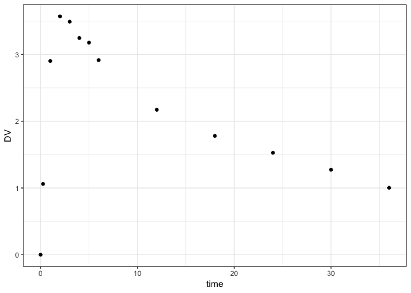

klava: parameter optimzation with mrgsolve
================

## Installation

``` r
devtools:::install_github("kylebaron/klava")
```

## Example

``` r
library(dplyr)
library(mrgsolve)
library(nloptr)
library(ggplot2)
library(klava)
library(rlang)
```

Load an mrgsolve model

``` r
mod <- modlib("pk2")
```

    . Building pk2 ... done.

Grab some data

``` r
data <- readRDS("inst/data/2cmtA.RDS")

ggplot(data, aes(time,DV)) + geom_point() + theme_bw()
```

<!-- -->

Define a parameter list

``` r
theta <- all_log(CL = 0.5, V2 = 50, Q = 1, V3 = 30, KA = 1, sigma=1)
```

Fit the
model

``` r
fit <- fit_nl(theta, data, pred_name= "CP", cov_step=TRUE, pred_initial=TRUE)
```

    . Checking data ...

    . Fitting with els ...done.
    . Generating predictions.
    . Trying cov step ... Loading required namespace: nlme
    . success.

Result

``` r
fit$tab
```

    . # A tibble: 6 x 4
    .   par   start    final     se
    .   <chr> <dbl>    <dbl>  <dbl>
    . 1 CL      0.5  0.955   0.0308
    . 2 V2     50   21.5     0.0565
    . 3 Q       1    1.89    0.279 
    . 4 V3     30    8.87    0.120 
    . 5 KA      1    1.10    0.0791
    . 6 sigma   1    0.00153 0.408

``` r
ggplot(fit$data) + 
  geom_line(aes(time,PRED),col="black", lwd=1) +
  geom_line(aes(time,INITIAL), col = "grey", lty=2, lwd=1) + 
  geom_point(aes(time,DV),size=3, col = "firebrick")  + 
  scale_y_log10() + theme_bw()
```

<!-- -->

## Objective functions

ELS

``` r
fit <- fit_nl(theta, data, pred_name= "CP", ofv=els)
```

    . Checking data ...

    . Fitting with els ...done.
    . Generating predictions.

Normal likelihood

``` r
fit <- fit_nl(theta, data, pred_name= "CP", ofv=ml)
```

    . Checking data ...

    . Fitting with ml ...done.
    . Generating predictions.

OLS

``` r
fit <- fit_nl(theta, data, pred_name= "CP", ofv=ols)
```

    . Checking data ...

    . Fitting with ols ...done.
    . Generating predictions.

WLS

``` r
fit <- fit_nl(theta, data, pred_name= "CP", ofv=wls)
```

    . Checking data ...

    . Fitting with wls ...done.
    . Generating predictions.
