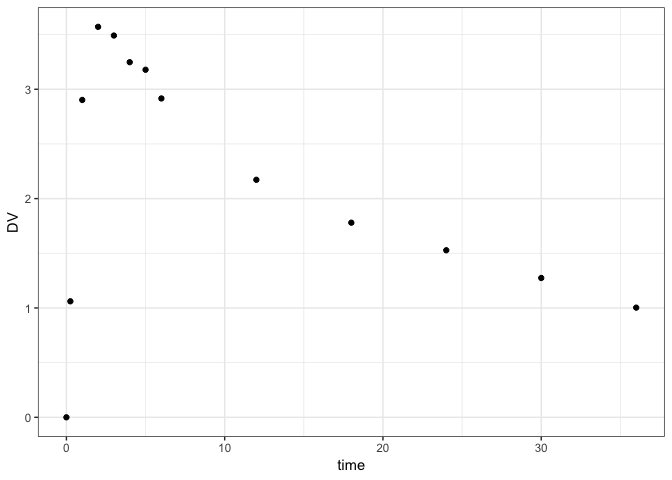
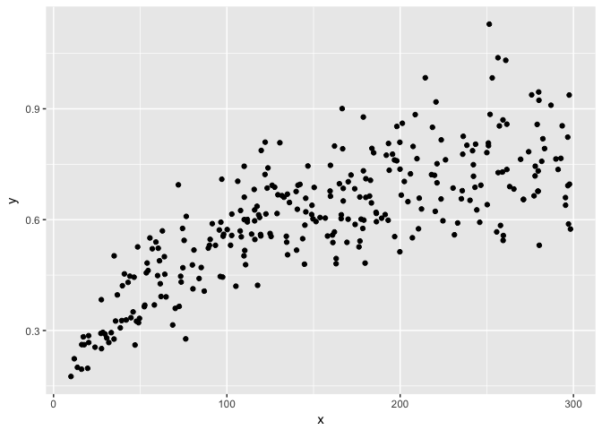
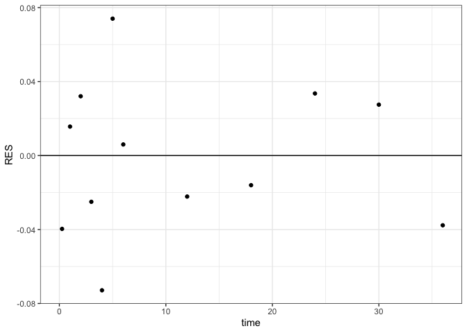
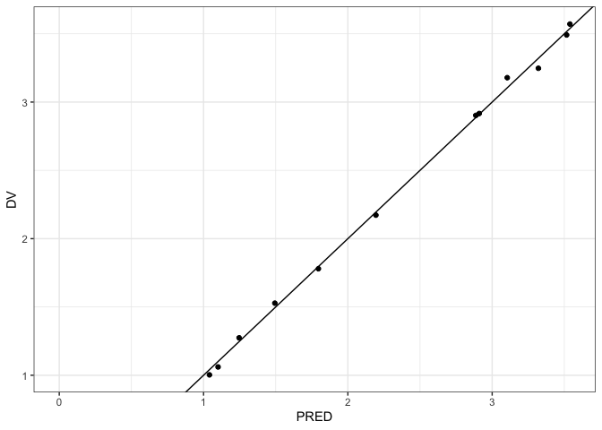

klava: parameter optimzation with mrgsolve
================

## Installation

``` r
devtools:::install_github("kylebaron/klava")
```

## Example

``` r
library(dplyr)
library(mrgsolve)
library(nloptr)
library(ggplot2)
library(klava)
library(rlang)
```

Load an mrgsolve model

``` r
mod <- modlib("pk2")
```

    . Building pk2 ... done.

Grab some data

``` r
data <- readRDS("inst/dat/2cmtA.RDS")

ggplot(data, aes(time,DV)) + geom_point() + theme_bw()
```

<!-- -->

The data is more or less in NONMEM-type format

``` r
data
```

    . # A tibble: 13 x 11
    .       ID  time  evid   mdv   amt   cmt    ss    ii  addl  rate    DV
    .    <dbl> <dbl> <dbl> <dbl> <dbl> <dbl> <dbl> <dbl> <dbl> <dbl> <dbl>
    .  1     1  0        1     1   100     1     0     0     0     0  0   
    .  2     1  0.25     0     0     0     0     0     0     0     0  1.06
    .  3     1  1        0     0     0     0     0     0     0     0  2.90
    .  4     1  2        0     0     0     0     0     0     0     0  3.57
    .  5     1  3        0     0     0     0     0     0     0     0  3.49
    .  6     1  4        0     0     0     0     0     0     0     0  3.25
    .  7     1  5        0     0     0     0     0     0     0     0  3.18
    .  8     1  6        0     0     0     0     0     0     0     0  2.92
    .  9     1 12        0     0     0     0     0     0     0     0  2.17
    . 10     1 18        0     0     0     0     0     0     0     0  1.78
    . 11     1 24        0     0     0     0     0     0     0     0  1.53
    . 12     1 30        0     0     0     0     0     0     0     0  1.27
    . 13     1 36        0     0     0     0     0     0     0     0  1.00

Define a parameter
list

``` r
theta <- all_log(CL = 0.5, V2 = 50, Q = 1.1, V3 = 30, KA = 1.1, sigma=1.1)
```

Fit the model

``` r
fit <- fit_nl(theta, data, mod = mod, pred_name= "CP", cov_step=TRUE,
              pred_initial=TRUE)
```

    . Checking data ...

    . Fitting with els ...done.
    . Generating predictions.
    . Trying cov step ... success.

Result

``` r
fit$tab
```

    . # A tibble: 6 x 5
    .   par   start    final        lb       ub
    .   <chr> <dbl>    <dbl>     <dbl>    <dbl>
    . 1 CL      0.5  0.955    0.900     1.01   
    . 2 V2     50   21.5     19.2      24.0    
    . 3 Q       1.1  1.89     1.10      3.27   
    . 4 V3     30    8.87     7.01     11.2    
    . 5 KA      1.1  1.10     0.941     1.28   
    . 6 sigma   1.1  0.00153  0.000687  0.00340

``` r
plot(fit)
```

<!-- -->

``` r
ggplot(fit$data, aes(time,RES)) + geom_point() + 
  geom_hline(yintercept=0) + theme_bw()
```

<!-- -->

``` r
ggplot(fit$data, aes(PRED,DV)) + geom_point() + 
  geom_abline(intercept = 0, slope = 1) + theme_bw()
```

<!-- -->

## Objective functions

Extended Least Squares - ELS

``` r
fit <- fit_nl(theta, data, mod, pred_name= "CP", ofv=els)
```

    . Checking data ...

    . Fitting with els ...done.
    . Generating predictions.

Normal likelihood

``` r
fit <- fit_nl(theta, data, mod, pred_name= "CP", ofv=ml)
```

    . Checking data ...

    . Fitting with ml ...done.
    . Generating predictions.

Ordinary Least Squares - OLS

``` r
fit <- fit_nl(theta, data, mod, pred_name= "CP", ofv=ols)
```

    . Checking data ...

    . Fitting with ols ...done.
    . Generating predictions.

Weighted Least Squares - WLS

``` r
fit <- fit_nl(theta, data, mod, pred_name= "CP", ofv=wls)
```

    . Checking data ...

    . Fitting with wls ...done.
    . Generating predictions.
